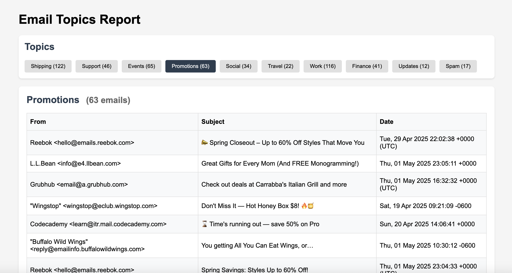

# Email Topic Classifier 📧

[](https://www.python.org/downloads/)
[](https://opensource.org/licenses/MIT)
[](http://makeapullrequest.com)

A machine learning system that automatically categorizes emails into 10 distinct topics using both content and sender information. The classifier uses a dual-feature pipeline combining TF-IDF vectorization with sender domain analysis to achieve high accuracy on both straightforward and ambiguous cases.

<!-- Add screenshot of the HTML interface here -->


## Features

- 10 distinct email topics
- High-accuracy classification (85% on straightforward cases, 70% on ambiguous cases)
- Interactive HTML report
- Includes test suite with separate evaluation for straightforward and ambiguous cases
- Comprehensive evaluation metrics including cross-validation and confusion matrix


## Supported Topics

The classifier can categorize emails into these topics:
- Work
- Shipping
- Finance
- Travel
- Promotions
- Social
- Updates
- Support
- Spam
- Events

## 🚀 Quick Start

1. **Clone the repository:**
   ```bash
   git clone https://github.com/yourusername/email-topic-classifier.git
   cd email-topic-classifier
   ```

2. **Set up the environment:**
   ```bash
   python -m venv venv
   source venv/bin/activate  # On Windows: venv\Scripts\activate
   pip install -r requirements.txt
   ```

3. **Export emails from Gmail:**
   ```bash
   # 1. Generate an App Password (Security Key):
   #    - Go to your Google Account settings
   #    - Navigate to Security
   #    - Enable 2-Step Verification if not already enabled
   #    - Go to App Passwords
   #    - Select "Mail" and your device
   #    - Copy the generated 16-character security key

   # 2. Export emails using the security key:
   #    Use --days 30 to only export emails from the past 30 days
   python export_gmail.py --email "your.email@gmail.com" --app-password "your-16-char-security-key" --output "emails" --days 30
   ```

4. **Train the model:**
   ```bash
   python email_topic_classifier.py --train
   ```

5. **Process your emails:**
   ```bash
   # Process .eml files and organize by topic
   python email_processor.py --input "emails" --output "organized_emails"
   ```

6. **View the report:**
   Open `organized_emails/email_report.html` in your browser

## Usage Examples

### Basic Classification
```python
from email_topic_classifier import EmailTopicClassifier

# Initialize and train
classifier = EmailTopicClassifier()
classifier.train(texts, labels)

# Make predictions
topic = classifier.predict("Your payment has been processed")
print(f"Predicted topic: {topic}")
```

### Process Multiple Emails
```bash
# Export emails from Gmail
python export_gmail.py --email "your.email@gmail.com" --app-password "your-16-char-security-key" --output "emails" --days 30

# Process and organize them
python email_processor.py --input "emails" --output "organized_emails"
```

## Customization

### Adding Custom Training Data
```python
custom_emails = [
    ("Your meeting is scheduled for tomorrow", "work"),
    ("Family dinner this weekend", "personal"),
    # Add more examples...
]

texts, labels = zip(*custom_emails)
classifier.train(texts, labels)
```

## Running Tests

```bash
python -m unittest discover tests
```

## License

This project is licensed under the MIT License.